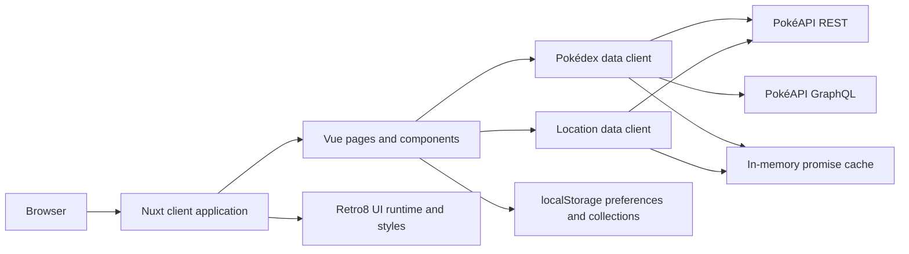

<p align="center">
  
</p>

<h1 align="center">RetroDex</h1>

<p align="center">
  A production-oriented, multilingual Pokédex built with Nuxt 4, PokéAPI, and Retro8 UI.
</p>

<p align="center">
  <a href="https://regiszaum.github.io/pokeapp-with-retro8-ui/"><strong>Live demo</strong></a>
  ·
  <a href="https://github.com/regiszaum/pokeapp-with-retro8-ui">Repository</a>
</p>

<p align="center">
  
  
  
  
</p>

## Overview

RetroDex is a client-side web application that turns PokéAPI data into a complete, responsive Pokédex experience. It combines a strongly typed data layer with a deliberate 8-bit interface, localized Pokémon data, persistent personal collections, geographic encounter exploration, and an integrated retro music player.

The project also serves as a practical implementation of [Retro8 UI](https://github.com/regiszaum/retro8-ui), using its semantic `r8-*` classes, design tokens, accessible components, and optional JavaScript runtime throughout the interface.

## Features

- Complete Pokémon catalog organized by National Pokédex number, generation, region, and type.
- Search by Pokémon name, number, generation, or region.
- Generation and type filters with URL-synchronized state.
- Sorting by National Pokédex number, localized name, generation, captured status, or favorites.
- Configurable pagination with 12, 24, or 48 entries per page.
- Persistent favorite and captured collections stored locally in the browser.
- Detailed Pokémon pages with:
  - official and shiny artwork;
  - types, dimensions, experience, capture data, and base stats;
  - localized abilities and selected moves;
  - evolution chains and evolution conditions;
  - weaknesses, resistances, and immunities;
  - varieties, habitat, growth rate, egg groups, and Pokédex descriptions;
  - official Pokémon cries when available.
- Geographic explorer for regions, locations, encounter areas, methods, versions, levels, and encounter chances.
- Pal Park area and encounter data.
- Portuguese, English, and Japanese interfaces with localized PokéAPI resources and fallback chains.
- Dark and light themes plus protanopia, deuteranopia, and tritanopia color-vision modes.
- Built-in 8-bit music player with playlist, transport controls, and volume adjustment.
- Pixelarticons-based icon system and custom pixel cursors.
- Responsive layouts, semantic HTML, visible focus states, keyboard-friendly controls, and accessible labels.

## Application Routes

| Route | Purpose |
| --- | --- |
| `/` | Main Pokédex catalog, filters, pagination, favorites, and captured state. |
| `/pokemon/:id` | Full detail view for a Pokémon species and its default variety. |
| `/localizacoes` | Region, location, encounter-area, and Pal Park explorer. |
| `/sobre` | Project and author information. |

## How It Works

### 1. Application startup

`app/app.vue` provides the global navigation, language selector, theme controls, and music player. On mount, the application restores the selected locale, visual theme, and color-vision mode from `localStorage`. Nuxt updates the document language and theme attributes reactively.

RetroDex is configured as a client-side application with `ssr: false`. Page data is loaded in the browser through Nuxt's `useAsyncData`, with `server: false` explicitly set for the main data bootstraps.

### 2. Pokédex bootstrap

The home page calls `fetchPokedexBootstrap()` to assemble the catalog. The data client requests generations, types, regions, and language metadata from the PokéAPI REST endpoints in parallel. A PokéAPI GraphQL query retrieves the localized species-name index efficiently.

The raw responses are normalized into typed application models containing generation summaries, region labels, Pokémon entries, type summaries, and a precomputed type-to-species index. Filtering, sorting, and pagination then happen locally through Vue computed state, without additional requests for each interaction.

### 3. Search and filter state

Search text, generation, type, sort mode, page, and page size are synchronized with route query parameters. This keeps filtered views shareable and allows browser navigation to restore the current catalog state.

Favorites and captured Pokémon are stored under `retrodex:favorites` and `retrodex:caught`. They remain private to the browser and are shared between the catalog and detail pages.

### 4. Pokémon details

The dynamic `/pokemon/:id` route loads species and default-variety data on demand. The client combines Pokémon, species, generation, type, evolution-chain, resource-name, and artwork data into a single `PokemonDetail` model.

Independent requests are performed concurrently where possible. The result is then mapped into presentation-ready values for stats, abilities, moves, evolution requirements, localized flavor text, damage multipliers, and related metadata.

### 5. Location explorer

The location module uses a dedicated API client. Its initial bootstrap loads region directories, location counts, area counts, localized species names, and Pal Park data. Location and encounter-area details are fetched only when the user changes the active selection.

Request counters prevent slower, outdated responses from replacing newer selections. Encounter search and pagination operate on normalized local data after an area has loaded.

### 6. Caching and error handling

Both API clients maintain in-memory promise caches keyed by request URL. Concurrent consumers reuse the same pending request, which reduces duplicate network traffic. Failed requests are removed from the cache so a later retry can make a fresh request.

PokéAPI requests use bounded retries and short retry delays. Pages expose loading, empty, error, and retry states using Retro8 UI feedback patterns.

### 7. Localization

The interface supports `pt-BR`, `en`, and `ja`. Locale selection follows this order:

1. a previously saved browser preference;
2. the browser language;
3. Brazilian Portuguese as the default.

PokéAPI names use locale-specific language fallback chains. Local resource dictionaries cover cases where the upstream API does not provide every translated type, stat, habitat, growth-rate, or egg-group label.

## Architecture



## Technology Stack

| Technology | Role |
| --- | --- |
| [Nuxt 4](https://nuxt.com/) | Application framework, routing, auto-imports, head management, and build pipeline. |
| [Vue 3](https://vuejs.org/) | Reactive state, computed views, watchers, and component composition. |
| [TypeScript](https://www.typescriptlang.org/) | Strict typing for API contracts, normalized models, components, and utilities. |
| [Retro8 UI](https://github.com/regiszaum/retro8-ui) | Semantic retro interface components, tokens, CSS, and interactive runtime. |
| [Pixelarticons](https://pixelarticons.com/) | Pixel-art SVG icons used across navigation and controls. |
| [PokéAPI](https://pokeapi.co/) | REST and GraphQL data for Pokémon, species, types, generations, locations, and encounters. |
| CSS | Application-specific composition, responsive layouts, themes, color-vision modes, and pixel cursors. |
| HTMLMediaElement API | Pokémon cry playback and the integrated music player. |
| pnpm | Reproducible dependency and script management. |
| GitHub Actions and Pages | Automated type checking, static build, artifact upload, and deployment. |

## Project Structure

```text
.
├── .github/workflows/
│   └── deploy.yml              # GitHub Pages CI/CD workflow
├── app/
│   ├── app.vue                 # Global application shell
│   ├── assets/
│   │   ├── css/main.css        # Themes, layout, responsive rules, and cursors
│   │   ├── cursors/            # Custom pixel cursor assets
│   │   ├── icons/              # Local pixel icon assets
│   │   ├── ogg/                # Retro music player tracks
│   │   └── png/                # Application artwork and branding
│   ├── components/             # Reusable UI and domain components
│   ├── composables/            # Theme and localization state
│   ├── i18n/                   # Messages, locale configuration, and resource names
│   ├── pages/                  # File-based application routes
│   ├── plugins/                # Retro8 UI client runtime integration
│   ├── types/                  # Typed domain models and runtime declarations
│   └── utils/                  # PokéAPI clients and formatting helpers
├── public/                     # Favicons and web app manifest
├── nuxt.config.ts              # Nuxt, global CSS, metadata, and base URL configuration
├── package.json                # Dependencies and project scripts
└── tsconfig.json               # TypeScript configuration
```

### Key modules

- `app/utils/pokeapi-client.ts`: main Pokédex REST/GraphQL client, localization, normalization, and request caching.
- `app/utils/pokeapi-locations.ts`: regions, locations, areas, encounters, and Pal Park client.
- `app/types/pokedex.ts`: normalized catalog and Pokémon detail contracts.
- `app/types/locations.ts`: normalized geographic and encounter contracts.
- `app/composables/useAppI18n.ts`: locale detection, translation, persistence, and locale-aware number formatting.
- `app/composables/useTheme.ts`: theme and color-vision state with browser persistence.
- `app/components/RetroSelect.vue`: Vue adapter for the Retro8 UI select interaction contract.
- `app/components/PixelIcon.vue`: typed Pixelarticons adapter with crisp 12, 24, and 48 pixel sizes.

## Getting Started

### Prerequisites

- Node.js 22 or newer.
- pnpm 11.8 or a compatible version enabled through Corepack.
- Internet access for PokéAPI, artwork, and external font resources.

### Installation

```bash
git clone https://github.com/regiszaum/pokeapp-with-retro8-ui.git
cd pokeapp-with-retro8-ui
corepack enable
pnpm install
```

### Development server

```bash
pnpm dev
```

The application will be available at `http://localhost:3000` by default.

## Available Scripts

| Command | Description |
| --- | --- |
| `pnpm dev` | Starts the Nuxt development server with hot module replacement. |
| `pnpm typecheck` | Runs Nuxt and Vue TypeScript validation. |
| `pnpm build` | Creates a production build using the default Nitro preset. |
| `pnpm generate` | Generates the application through Nuxt's standard static generation command. |
| `pnpm generate:github-pages` | Builds with Nuxt's `github_pages` preset. |
| `pnpm preview` | Runs the generated production build locally. |

## Configuration

### Base URL

`NUXT_APP_BASE_URL` controls the Nuxt application base path. It defaults to `/` for local development and conventional hosting.

For this repository's GitHub Pages path, run:

```bash
NUXT_APP_BASE_URL=/pokeapp-with-retro8-ui/ pnpm generate:github-pages
```

The value is also used when generating favicon, Apple touch icon, and manifest URLs, so static assets continue to resolve correctly when the application is hosted below a domain subpath.

No API key is required. PokéAPI is consumed through its public REST and GraphQL endpoints.

## Validation

Run both checks before opening a pull request or deploying a meaningful change:

```bash
pnpm typecheck
pnpm build
```

The project enables strict TypeScript checks in `nuxt.config.ts` and uses typed normalized models at the boundary between external API responses and the UI.

## Deployment

The workflow at `.github/workflows/deploy.yml` deploys the application to GitHub Pages on every push to `main` and can also be started manually.

The pipeline:

1. checks out the repository;
2. configures Node.js 22 and pnpm;
3. installs dependencies with the frozen lockfile;
4. runs `pnpm typecheck`;
5. builds the static site with the GitHub Pages preset;
6. uploads `.output/public`;
7. deploys the artifact through GitHub Pages.

## Data and Persistence

RetroDex does not require an application database or backend service. Pokémon and location data come from PokéAPI, while user-specific state remains in the browser.

| Storage key | Value |
| --- | --- |
| `retrodex:locale` | Selected application locale. |
| `retrodex:theme` | Light or dark theme preference. |
| `retrodex:color-vision` | Selected color-vision mode. |
| `retrodex:favorites` | Array of favorited Pokémon species names. |
| `retrodex:caught` | Array of captured Pokémon species names. |

Clearing browser storage resets these preferences and collections.

## Acknowledgements

- [PokéAPI](https://pokeapi.co/) for the Pokémon and geographic datasets.
- [Retro8 UI](https://github.com/regiszaum/retro8-ui) for the interface system.
- [Pixelarticons](https://pixelarticons.com/) for the pixel-art icon set.
- [Nuxt](https://nuxt.com/) and [Vue](https://vuejs.org/) for the application platform.

## Author

Created by [Régis Adriano](https://github.com/regiszaum).

- [GitHub](https://github.com/regiszaum)
- [LinkedIn](https://www.linkedin.com/in/regisadrianofilho/)
